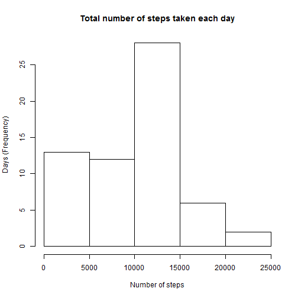
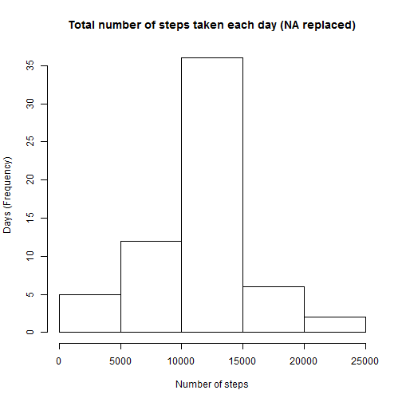
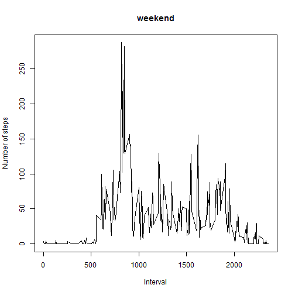
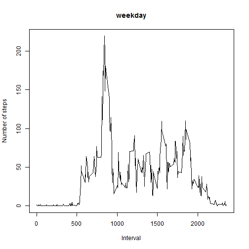

# Reproducible Research: Peer Assessment 1  

### 1. Loading and preprocessing the data  

```r
library(dplyr)
library(timeDate)

activity_tab <- read.csv2("activity.csv", sep=",", header = TRUE, na.strings = "NA")
activity_tab$date <- as.Date(activity_tab$date, format="%Y-%m-%d")
```
___

### 2. What is mean total number of steps taken per day?  
  
#### Calculate the total number of steps taken per day  

```r
daily_activity <- activity_tab %>% group_by(date)
daily_activity <- summarise(daily_activity, nb_step = sum(steps,  na.rm = TRUE))
daily_activity
```

```
## Source: local data frame [61 x 2]
## 
##          date nb_step
##        (date)   (int)
## 1  2012-10-01       0
## 2  2012-10-02     126
## 3  2012-10-03   11352
## 4  2012-10-04   12116
## 5  2012-10-05   13294
## 6  2012-10-06   15420
## 7  2012-10-07   11015
## 8  2012-10-08       0
## 9  2012-10-09   12811
## 10 2012-10-10    9900
## ..        ...     ...
```
  
#### Make a histogram of the total number of steps taken each day  

```r
hist(daily_activity$nb_step, freq = TRUE, xlab = "Number of steps", ylab = "Days (Frequency)", 
     main = "Total number of steps taken each day" )
```

 
  
#### Calculate and report the mean and median of the total number of steps taken per day  
Show mean and median value from a data frame :  

```r
daily_activity <- summarise(daily_activity, mean_step = mean(nb_step, na.rm = TRUE), median_step = median(nb_step, na.rm = TRUE))
daily_activity
```

```
## Source: local data frame [1 x 2]
## 
##   mean_step median_step
##       (dbl)       (int)
## 1   9354.23       10395
```
___

### 3. What is the average daily activity pattern?  
  
#### Make a time series plot of the 5-minute interval (x-axis) and the average number of steps taken, averaged across all days (y-axis)  

```r
daily_activity <- activity_tab %>% group_by(interval)
daily_activity <- summarise(daily_activity, nb_step = mean(steps,na.rm = TRUE))

plot(x = daily_activity$interval,y = daily_activity$nb_step, xlab = "5-minute interval", ylab = "Average number of steps taken", 
     main = "Average daily activity pattern", type = 'l')
```

 
  
#### Which 5-minute interval, on average across all the days in the dataset, contains the maximum number of steps?  
Get the top 1 interval by number of steps :  

```r
top_interval <- daily_activity %>% top_n(n=1)
top_interval
```

```
## Source: local data frame [1 x 2]
## 
##   interval  nb_step
##      (int)    (dbl)
## 1      835 206.1698
```
___

### 4. Imputing missing values  
  
#### Calculate and report the total number of missing values in the dataset (i.e. the total number of rows with NAs)  

```r
sum(is.na(activity_tab$steps))
```

```
## [1] 2304
```
#### Devise a strategy for filling in all of the missing values in the dataset. 
In the next steps we will replace the missing values by mean values from the corresponding intervals.  
  
#### Create a new dataset that is equal to the original dataset but with the missing data filled in.  

```r
daily_activity_na <-  filter(activity_tab, is.na(steps))
daily_activity_na <- left_join(daily_activity_na, daily_activity, by = "interval")
daily_activity_na$steps = daily_activity_na$nb_step
daily_activity_na <- daily_activity_na[,1:3]

activity_full <- rbind(daily_activity_na, activity_tab %>% filter(!is.na(steps)))
head(activity_full)
```

```
##       steps       date interval
## 1 1.7169811 2012-10-01        0
## 2 0.3396226 2012-10-01        5
## 3 0.1320755 2012-10-01       10
## 4 0.1509434 2012-10-01       15
## 5 0.0754717 2012-10-01       20
## 6 2.0943396 2012-10-01       25
```
  
#### Make a histogram of the total number of steps taken each day and Calculate and report the mean and median total number of steps taken per day.  

```r
daily_activity_full <- activity_full %>% group_by(date)
daily_activity_full <- summarise(daily_activity_full, nb_step = sum(steps,  na.rm = TRUE))
hist(daily_activity_full$nb_step, freq = TRUE, xlab = "Number of steps", ylab = "Days (Frequency)", 
     main = "Total number of steps taken each day (NA replaced)" )
```

 

```r
daily_activity_full_mean_med <- summarise(daily_activity_full, mean_step = mean(nb_step, na.rm = TRUE), median_step = median(nb_step, na.rm = TRUE))
head(daily_activity_full_mean_med)
```

```
## Source: local data frame [1 x 2]
## 
##   mean_step median_step
##       (dbl)       (dbl)
## 1  10766.19    10766.19
```
  
#### Do these values differ from the estimates from the first part of the assignment? What is the impact of imputing missing data on the estimates of the total daily number of steps?  
As we can see, the values are not equal to the ones we've calculated in the beggining of the assignment. Now we don't have any missing value, the calculated mean and the calculated median are exactly the same.  
___

### Are there differences in activity patterns between weekdays and weekends?
  
#### Create a new factor variable in the dataset with two levels - "weekday" and "weekend" indicating whether a given date is a weekday or weekend day.  

```r
activity_full$isWeekday <- isWeekday(daily_activity_full$date)
head(daily_activity_full)
```

```
## Source: local data frame [6 x 2]
## 
##         date  nb_step
##       (date)    (dbl)
## 1 2012-10-01 10766.19
## 2 2012-10-02   126.00
## 3 2012-10-03 11352.00
## 4 2012-10-04 12116.00
## 5 2012-10-05 13294.00
## 6 2012-10-06 15420.00
```
  
#### Make a panel plot containing a time series plot of the 5-minute interval (x-axis) and the average number of steps taken, averaged across all weekday days or weekend days (y-axis)  

```r
activity_weekday <- activity_full %>% filter(activity_full$isWeekday=="TRUE") %>% group_by(interval)
activity_weekday <- summarise(activity_weekday, nb_step = mean(steps, na.rm = TRUE))
activity_weekend <- activity_full %>% filter(activity_full$isWeekday=="FALSE") %>% group_by(interval)
activity_weekend <- summarise(activity_weekend, nb_step = mean(steps, na.rm = TRUE))

plot(x = activity_weekend$interval, y = activity_weekend$nb_step, type="l", main="weekend", xlab = "Interval", ylab = "Number of steps")
```

 

```r
plot(x = activity_weekday$interval, y = activity_weekday$nb_step, type="l", main="weekday", xlab = "Interval", ylab = "Number of steps")
```

 
